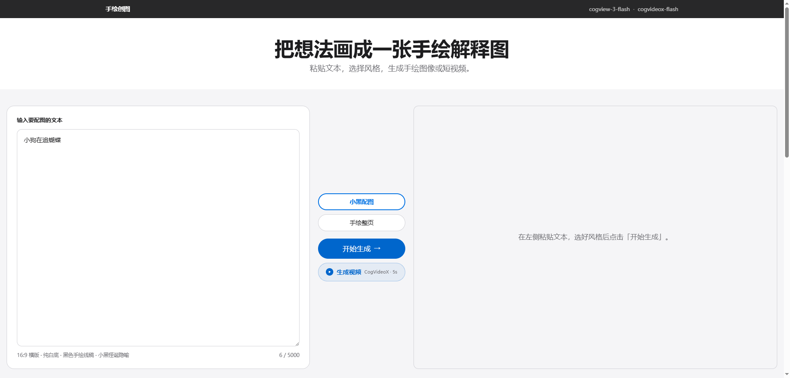
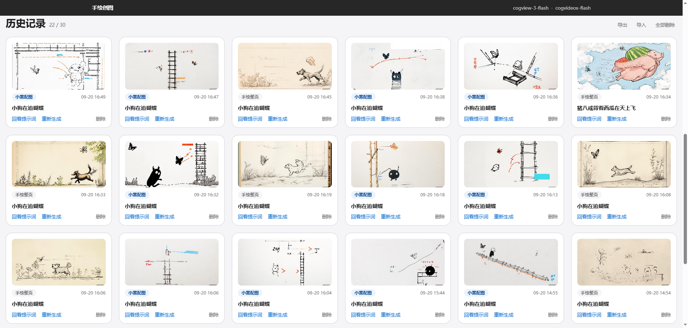

# 手绘创图

粘贴一段文本，选择风格，一键生成 Ian 风格的**手绘解释图**或**手绘短视频**。

基于智谱 CogView / CogVideoX 免费模型，内置从两个手绘技能语料移植的提示词组装器——无需撰写提示词，输入想法即可出图。

## 界面预览

**主界面**——左侧输入文本，中间切换风格并生成，右侧查看结果：



**历史记录**——最近 30 条自动保存（localStorage），支持导出/导入、单条删除、点击放大与左右浏览：



## 功能特性

- **两种手绘风格**：小黑怪诞配图（纯白底黑色线稿 + 小黑 IP）/ 中文手绘技术整页（暖白纸底 + 淡彩标签）
- **图像生成**：CogView-3-Flash（免费），16:9 比例，点击放大查看
- **视频生成**：CogVideoX-Flash（免费），1920x1080 / 30fps / 5 秒，异步任务 + 自动轮询
- **极简输入**：只需粘贴一段文本（≤5000 字），结构、构图、标题全部由提示词组装器自动推导
- **历史记录**：上限 30 条、超限提示、单条/全部删除、导出/导入 JSON 迁移、冷启动内置种子记录
- **内置历史**：仓库自带 10 条示例记录（图片已本地化到 `public/history-images/`，永不过期）
- **图片浏览**：结果区点击放大；历史图片灯箱支持 ‹ › 左右切换与键盘 ←/→ 导航

## 技术栈

React 18 + TypeScript + Vite · Vercel Serverless Functions · 智谱开放平台 API（CogView-3-Flash / CogVideoX-Flash）

- 提示词组装器移植自 Ian 的两个手绘技能语料（`prompts/` 目录 1:1 拷贝，代码常量为忠实压缩）
- API Key 仅在服务端读取，浏览器不直连生成 API

## 快速开始

```bash
npm install
cp .env.example .env.local   # 填入 ZHIPUAI_API_KEY
npm run dev
```

> dev server 已内置 API 路由（无需 vercel dev），打开 http://localhost:5173 即可使用。

## 部署到 Vercel

1. 导入仓库（框架预设 Vite，`api/` 目录自动识别为 Serverless Functions）
2. Settings → Environment Variables 添加：

   | 变量 | 说明 |
   |---|---|
   | `ZHIPUAI_API_KEY` | **必填**，[智谱开放平台](https://open.bigmodel.cn/) API Key |
   | `IMAGE_MODEL` | 可选，默认 `cogview-3-flash` |
   | `ZHIPU_API_BASE` | 可选，默认 `https://open.bigmodel.cn/api/paas/v4` |

3. 部署完成，访问应用即可

## 目录结构

```
├── api/                  # Serverless Functions
│   ├── generate.ts       #   POST 图像生成
│   ├── generate-video.ts #   POST/GET 视频生成（异步任务 + 轮询）
│   └── config.ts         #   GET 配置检查
├── src/
│   ├── prompts/          # 提示词组装器（语料的代码化压缩）
│   ├── components/       # 界面组件
│   └── lib/              # 历史记录（localStorage + 种子）
├── prompts/              # 手绘技能语料原文（1:1 拷贝）
├── public/
│   ├── history-images/   # 内置历史记录图片
│   └── seed-history.json # 冷启动种子历史
├── scripts/
│   └── fetch-history.mjs # 下载历史图片并生成种子（npm run fetch-history）
└── docs/design/spec/     # 需求文档（唯一事实来源）
```

## License

MIT © 2026 陆壹
